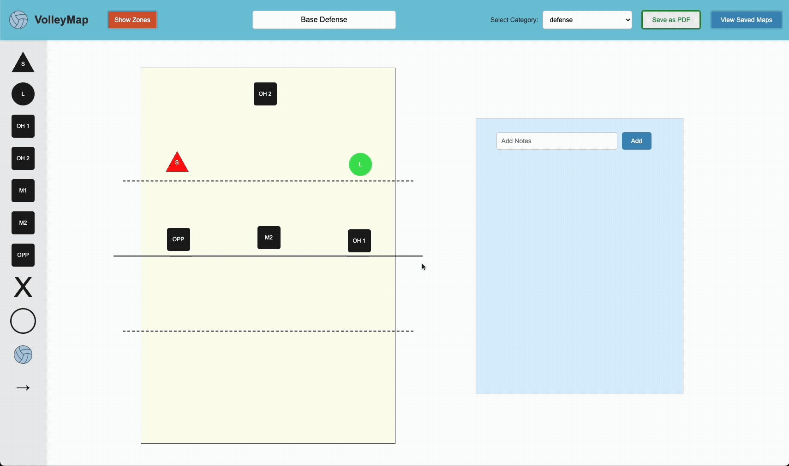

# VOLLEYMAP

## Elevate Your Game with Interactive Play Mapping

## Built with the tools and technologies:

## Overview

VolleyMap is an innovative developer tool designed to streamline the creation and management of volleyball plays, providing an interactive platform for coaches and players alike.

## Why VolleyMap?

This project revolutionizes how volleyball plays are visualized and managed. The core features include:

- 🏐 **Interactive Play Creation**: Users can visually design plays using a drag-and-drop interface, enhancing usability and engagement.

- 📄 **PDF Export**: Allows users to export their plays as PDFs for easy sharing and printing, addressing the need for tangible documentation.

- 📊 **Dynamic Data Management**: Facilitates the organization and retrieval of volleyball-related data, improving efficiency in managing plays and statistics.

- 🎨 **Customizable Visuals**: Users can personalize their plays with color options, making the tool more engaging and visually appealing.

- ⚙️ **Robust Backend Integration**: Ensures seamless communication with the backend for data storage and retrieval, enhancing performance and reliability.

## Demo

### 1. Creating a New Play

### 2. Using the Context Menu

### 3. Adding Notes

### 4. Saving Plays

### 5. Downloading Plays

### 6. Deleting Plays

